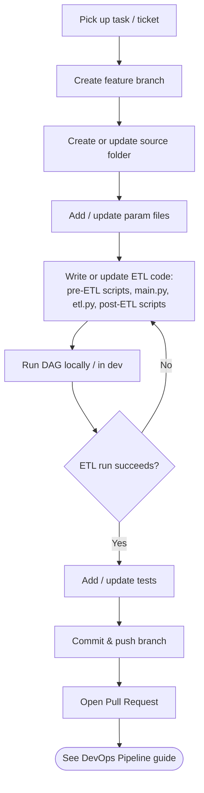

[← Back to Index](index.md)

# Development Guide

How to work on the ETL platform locally, from picking up a task to opening a pull
request. See also [Git Folder Setup](02-git-folder-setup.md) for where things live
and [Developer Guidelines](06-developer-guidelines.md) for coding standards.

## Prerequisites

- Python (version pinned in `requirements.txt` / project config)
- Access to the Git repo (Azure Repos)
- Local or dev Airflow instance (or the ability to trigger a dev DAG run)
- Access to the dev database for scaffolding/support tables

## Local Development Workflow

## Adding a New ETL Source

1. Create a new source folder under the source directory (see
   [Git Folder Setup](02-git-folder-setup.md)).
2. Add a param file for the source (per environment, if values differ).
3. Implement:
   - Pre-ETL bash script(s) — staging, validation, file moves.
   - `main.py` — orchestration entrypoint invoked by the Airflow DAG.
   - `etl.py` — the transform logic called from `main.py`.
   - Post-ETL bash/python script(s) — publish, cleanup, notifications.
4. Register/update the Airflow DAG to call the new pre-ETL scripts, `main.py`, and
   post-ETL scripts in order.
5. If the source needs new control/support tables, coordinate creation of the DB
   scaffolding (manual step — see [Git Folder Setup](02-git-folder-setup.md)).
6. Test end-to-end in dev before opening a PR.

## Local Testing Checklist

- [ ] Pre-ETL scripts run cleanly against sample/staged input
- [ ] `main.py` / `etl.py` produce expected output for a known test case
- [ ] Post-ETL scripts complete and clean up correctly
- [ ] Param files contain no hard-coded secrets or environment-specific values
- [ ] DAG runs end-to-end in dev without manual intervention
