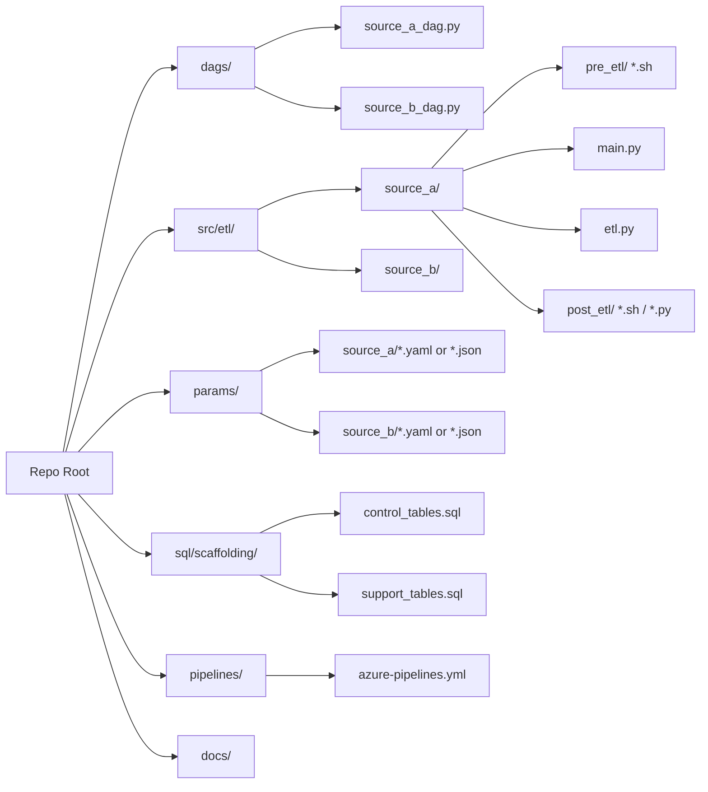

[← Back to Index](index.md)

# Git Folder Setup

Standard repository layout for the ETL platform. All ETL code, DAGs, and param
files are stored in Git; DB scaffolding is tracked here as SQL but applied
manually (see note below).

## Folder Structure

## Folder Purpose

| Folder | Purpose |
|--------|---------|
| `dags/` | Airflow DAG definitions. One DAG per source (or logical grouping), calling pre-ETL scripts → `main.py` → post-ETL scripts. |
| `src/etl/<source>/` | ETL code for a single source: `pre_etl/` bash scripts, `main.py` orchestrator, `etl.py` core transform, `post_etl/` bash/python scripts. |
| `params/<source>/` | Parameter files, kept separate from code so config can change without a code deploy. One set per environment where values differ. |
| `sql/scaffolding/` | DDL for ETL control/support tables (run logs, source config, watermark tables, etc.). Tracked in Git for history, but **applied manually** to each environment — not part of the automated pipeline. |
| `pipelines/` | Azure DevOps pipeline YAML definitions (build/test/release). |
| `docs/` | This documentation set. |

## Naming Conventions

- Source folders under `src/etl/` and `params/` use the same name (e.g. `source_a`)
  so code and config are easy to pair up.
- DAG files are named `<source>_dag.py` and map 1:1 to a source folder.

## Manual/Out-of-Pipeline Setup

Two things are **not** created automatically by the CI/CD pipeline and must be set
up manually when onboarding a new source or environment:

1. **Source folder(s)** for staging/raw data, outside the repo (on shared storage
   or the target environment).
2. **DB scaffolding/support tables**, using the DDL in `sql/scaffolding/` as the
   reference — applied by hand to each environment's database.

These manual steps are called out again in
[DevOps: New Repo Setup](03-devops-new-repo-setup.md) and the
[Deployment Guide](07-deployment-guide.md).
