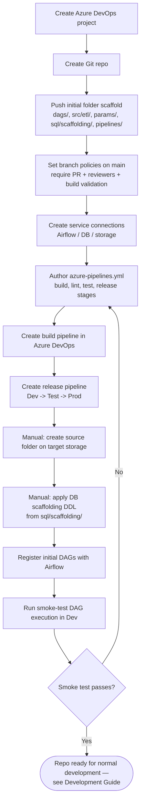

[← Back to Index](index.md)

# DevOps: New Repo Setup

Steps to stand up Azure DevOps from scratch for a **new** ETL project. Use this
once per project; for adding code to an existing project's repo, see
[DevOps: Pipeline for Existing Repo](04-devops-pipeline-existing-repo.md).

## Flow

## Steps in Detail

1. **Create the Azure DevOps project** (if one doesn't already exist for this
   platform/team).
2. **Create the Git repo** and push the initial folder scaffold described in
   [Git Folder Setup](02-git-folder-setup.md).
3. **Branch policies on `main`**: require pull requests, minimum reviewer count,
   and a passing build before merge.
4. **Service connections**: configure connections to Airflow, the target
   database, and any storage used by pre/post-ETL scripts.
5. **Pipeline YAML** (`pipelines/azure-pipelines.yml`): define build (lint/test)
   and release (deploy) stages — see
   [DevOps: Pipeline for Existing Repo](04-devops-pipeline-existing-repo.md) for
   what the pipeline does on every change.
6. **Build pipeline**: create it in Azure DevOps, pointed at the YAML file.
7. **Release pipeline**: define environment stages (Dev → Test → Prod) with
   approvals as required by [Developer Guidelines](06-developer-guidelines.md).
8. **Manual steps** (not automated by the pipeline):
   - Create the source folder(s) on target storage for staging/raw data.
   - Apply the DB scaffolding DDL (`sql/scaffolding/`) to create control/support
     tables in each environment's database.
9. **Register the DAG(s)** with the Airflow instance for that environment.
10. **Smoke test**: trigger a DAG run end-to-end in Dev to confirm the whole
    chain (pre-ETL → `main.py`/`etl.py` → post-ETL) works before normal
    development begins.
