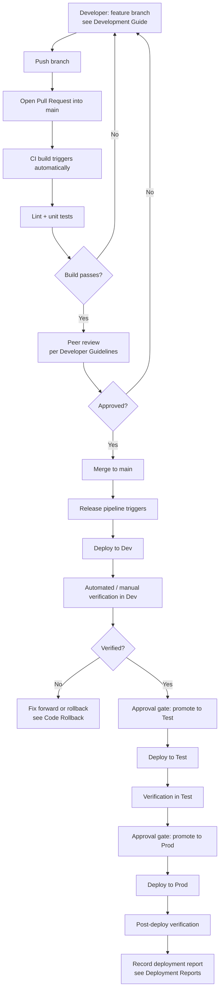

[← Back to Index](index.md)

# DevOps Pipeline: Adding Code to an Existing Repo

The standard CI/CD flow used every time code is added or changed in a repo that
is already set up (see [DevOps: New Repo Setup](03-devops-new-repo-setup.md) for
first-time setup).

## Flow

## What the Pipeline Does at Each Stage

| Stage | Automated actions |
|-------|--------------------|
| **Build (on PR)** | Checkout, install dependencies, lint, run unit tests against `etl.py` / `main.py`, validate param file schema. |
| **Deploy — Dev** | Sync `dags/`, `src/etl/`, `params/` to the Dev Airflow environment; does **not** modify DB scaffolding automatically. |
| **Deploy — Test** | Same as Dev, against Test environment; requires approval gate. |
| **Deploy — Prod** | Same, against Prod; requires approval gate and typically a change ticket per [Developer Guidelines](06-developer-guidelines.md). |

## Notes

- Param file changes go through the same PR/pipeline flow as code changes — they
  are not edited directly in an environment.
- If a change requires new or altered DB scaffolding tables, that DDL change is
  reviewed in the PR but **applied manually** to each environment in step with
  the deployment (not run automatically by the release pipeline) — see
  [Git Folder Setup](02-git-folder-setup.md).
- Every promotion to Test or Prod should have a corresponding entry in
  [Deployment Reports](08-deployment-reports.md).
