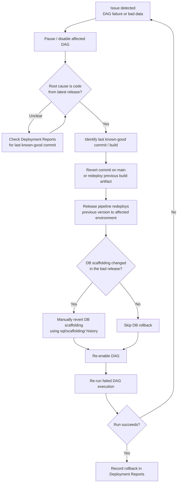

[← Back to Index](index.md)

# Code Rollback

Procedure for rolling back a deployment that has caused a failure in an ETL run
or produced bad output.

## Flow

## Rollback Options

1. **Revert commit (preferred for code-only issues)**
   - Open a revert PR against `main` for the offending commit(s).
   - Goes through the normal
     [pipeline](04-devops-pipeline-existing-repo.md) — build, review, deploy.
   - Preferred because it keeps Git history accurate and re-uses the standard
     CI/CD path.

2. **Redeploy previous release artifact (for urgent production issues)**
   - Use the release pipeline to redeploy the last known-good build to the
     affected environment without waiting for a new PR.
   - Follow up with a proper revert PR afterward so `main` reflects reality.

## DB Scaffolding Rollback

Because scaffolding/support tables are applied manually, a rollback that
touches them is also manual:

- Use the DDL history in `sql/scaffolding/` (via Git history) to determine what
  changed.
- Manually apply the reverse change to the affected environment's database.
- Double-check any control/state tables (e.g. watermarks, run status) are
  consistent before re-running the DAG — a rolled-back code version running
  against un-rolled-back state can reprocess or skip data incorrectly.

## After a Rollback

- Confirm the DAG completes successfully post-rollback.
- Log the rollback — cause, actions taken, environments affected — in
  [Deployment Reports](08-deployment-reports.md).
- Open a follow-up ticket to fix the root cause before the next deployment
  attempt.
