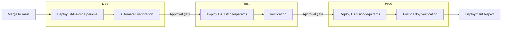

[← Back to Index](index.md)

# Deployment Guide

End-to-end view of how a change moves from `main` to Production, combining the
[pipeline mechanics](04-devops-pipeline-existing-repo.md) with the manual steps
that sit alongside it.

## Environment Promotion

## What Moves Automatically vs. Manually

| Item | Deployment method |
|------|--------------------|
| `dags/` | Automated — release pipeline syncs to Airflow per environment |
| `src/etl/<source>/` (pre-ETL, main.py, etl.py, post-ETL) | Automated — release pipeline |
| `params/<source>/` | Automated — release pipeline |
| `pipelines/azure-pipelines.yml` | Automated (self-updates on merge) |
| Source folder(s) on target storage | **Manual** — created once per source/environment |
| DB scaffolding / support tables | **Manual** — DDL reviewed in PR, applied by hand per environment |

## Pre-Deployment Checklist

- [ ] PR approved and CI build green
- [ ] Any DB scaffolding DDL identified and reviewed
- [ ] Deployment report drafted (see [Deployment Reports](08-deployment-reports.md))
- [ ] Rollback plan identified (see [Code Rollback](05-code-rollback.md))

## Per-Environment Steps

1. **Dev**: deploy automatically on merge to `main`; run automated checks / a
   manual smoke test of the affected DAG.
2. **Test**: promote via approval gate; apply any DB scaffolding changes to Test
   manually before or alongside the deploy; verify DAG run.
3. **Prod**: promote via approval gate (and change ticket, if required by your
   team's process); apply DB scaffolding changes to Prod manually; verify DAG
   run; complete the deployment report.

## After Deployment

- Confirm the DAG runs successfully in the target environment.
- Record the deployment in [Deployment Reports](08-deployment-reports.md).
- If verification fails, follow [Code Rollback](05-code-rollback.md).
