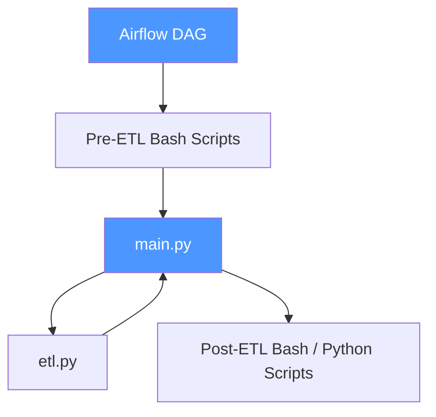

# ETL Platform — Documentation Index

This documentation set describes the custom Python ETL platform (orchestrated by
Airflow) and the Azure DevOps processes used to develop, deploy, and support it.

## System Overview

An Airflow DAG drives each ETL run: pre-ETL bash scripts prepare the environment,
`main.py` runs the core transform (`etl.py`), and post-ETL bash/python scripts
finalize and hand off the output.

Supporting elements outside the DAG:
- **Param files** — one set per source/environment, kept separate from ETL code.
- **Source folders** — per-source working areas for raw/staged data.
- **DB scaffolding tables** — control/support tables (run logs, source config, etc.),
  created manually rather than via pipeline.
- **Git** — single source of truth for all ETL code, DAGs, and param files.

## Contents

| # | Guide | What it covers |
|---|-------|-----------------|
| 1 | [Development Guide](01-development-guide.md) | Local setup, day-to-day dev workflow, adding a new source |
| 2 | [Git Folder Setup](02-git-folder-setup.md) | Repository layout and the purpose of each folder |
| 3 | [DevOps: New Repo Setup](03-devops-new-repo-setup.md) | Steps to stand up a brand-new Azure DevOps repo + pipeline |
| 4 | [DevOps: Pipeline for Existing Repo](04-devops-pipeline-existing-repo.md) | CI/CD flow for adding code to an existing repo |
| 5 | [Code Rollback](05-code-rollback.md) | How to roll back a bad deployment |
| 6 | [Developer Guidelines](06-developer-guidelines.md) | Coding, naming, and PR conventions |
| 7 | [Deployment Guide](07-deployment-guide.md) | End-to-end environment promotion (Dev → Test → Prod) |
| 8 | [Deployment Reports](08-deployment-reports.md) | What to record for every release |

## Suggested Reading Order

- **New team member:** 1 → 2 → 6 → 7
- **Setting up a new project/repo:** 2 → 3 → 7
- **Shipping a change:** 6 → 4 → 8
- **Incident response:** 5 → 8
